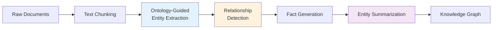
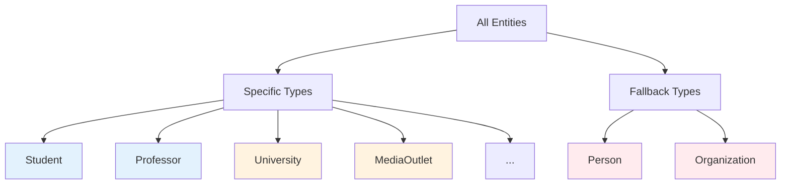

## What are Knowledge Graphs in MiroFish?

Knowledge graphs in MiroFish represent the **collective understanding** of a scenario or event. They capture:

- **Entities**: People, organizations, locations, events, concepts
- **Relationships**: How entities are connected (works_for, supports, opposes, etc.)
- **Facts**: Specific statements about entities and their relationships
- **Summaries**: AI-generated descriptions of entities based on accumulated information

Unlike traditional databases, knowledge graphs allow **semantic reasoning** and **contextual retrieval** - you can ask "who opposes this policy?" or "what are the stakeholders in this event?" and get meaningful answers.

## GraphRAG: From Text to Graph

MiroFish uses **GraphRAG** (Graph Retrieval-Augmented Generation) to automatically build knowledge graphs from unstructured text.

### The GraphRAG Process



<Steps>
  <Step title="Text Chunking">
    Documents are split into overlapping chunks (default: 500 characters with 50-character overlap) to ensure context continuity
  </Step>
  
  <Step title="Ontology-Guided Extraction">
    Using the custom ontology, Zep's LLM extracts entities matching the defined entity types (Student, Professor, University, etc.)
  </Step>
  
  <Step title="Relationship Detection">
    The LLM identifies relationships between entities based on the defined edge types (WORKS_FOR, STUDIES_AT, SUPPORTS, etc.)
  </Step>
  
  <Step title="Fact Generation">
    Each relationship is stored as a human-readable fact (e.g., "Alice studies at Wuhan University")
  </Step>
  
  <Step title="Entity Summarization">
    Zep automatically generates summaries for each entity by aggregating information from all related facts
  </Step>
</Steps>

## Ontology Generation Process

Before building the graph, MiroFish generates a custom **ontology** (schema) tailored to your specific use case.

### Why Custom Ontologies?

Different scenarios require different entity types:
- **Academic scandal**: Student, Professor, University, MediaOutlet
- **Financial event**: Company, Executive, Investor, RegulatoryAgency
- **Political debate**: Politician, Party, Voter, NGO

A one-size-fits-all ontology would miss domain-specific nuances.

### The Ontology Generator

Location: `backend/app/services/ontology_generator.py`

<CodeGroup>
```python Key Method
def generate(
    self,
    document_texts: List[str],
    simulation_requirement: str,
    additional_context: Optional[str] = None
) -> Dict[str, Any]:
    """
    Generate custom ontology for social simulation
    
    Returns:
        entity_types: List of 10 entity types (8 specific + 2 fallback)
        edge_types: List of 6-10 relationship types
        analysis_summary: Reasoning about the design
    """
```

```json Example Output
{
  "entity_types": [
    {
      "name": "Student",
      "description": "University students involved in the incident",
      "attributes": [
        {"name": "major", "type": "text", "description": "Field of study"},
        {"name": "year", "type": "text", "description": "Academic year"}
      ],
      "examples": ["undergraduate", "graduate student"]
    },
    {
      "name": "Professor",
      "description": "Faculty members and academic researchers",
      "attributes": [
        {"name": "department", "type": "text", "description": "Academic department"},
        {"name": "title", "type": "text", "description": "Academic rank"}
      ]
    },
    // ... 6 more specific types ...
    {
      "name": "Person",
      "description": "Any individual not fitting other specific types",
      "attributes": [{"name": "full_name", "type": "text"}]
    },
    {
      "name": "Organization",
      "description": "Any organization not fitting other specific types",
      "attributes": [{"name": "org_name", "type": "text"}]
    }
  ],
  "edge_types": [
    {
      "name": "STUDIES_AT",
      "description": "A student is enrolled at an institution",
      "source_targets": [{"source": "Student", "target": "University"}]
    },
    {
      "name": "SUPPORTS",
      "description": "Expresses support for an entity or position",
      "source_targets": [
        {"source": "Student", "target": "Professor"},
        {"source": "Organization", "target": "Person"}
      ]
    }
    // ... more edge types ...
  ]
}
```
</CodeGroup>

### Ontology Design Principles

From `ontology_generator.py:73-154`:

<Accordion title="Entity Type Requirements">
  **Must have exactly 10 entity types**:
  - 8 specific types tailored to the scenario
  - 2 fallback types (Person, Organization) for entities that don't fit specific categories
  
  **Entity types must be**:
  - Real-world agents that can post on social media
  - NOT abstract concepts (e.g., "public opinion", "trend")
  - NOT topics (e.g., "education reform")
  - NOT viewpoints (e.g., "supporters", "opponents")
  
  **Examples of valid entities**:
  - Individuals: Student, Professor, Journalist, Celebrity, Official
  - Organizations: University, Company, MediaOutlet, GovernmentAgency
</Accordion>

<Accordion title="Relationship Type Requirements">
  **Should have 6-10 edge types** reflecting real social connections:
  - Structural: WORKS_FOR, STUDIES_AT, AFFILIATED_WITH
  - Informational: REPORTS_ON, COMMENTS_ON, RESPONDS_TO
  - Attitudinal: SUPPORTS, OPPOSES, COLLABORATES_WITH
  
  **Each edge type specifies valid source-target pairs**:
  ```python
  "WORKS_FOR": {
    "source_targets": [
      {"source": "Professor", "target": "University"},
      {"source": "Journalist", "target": "MediaOutlet"}
    ]
  }
  ```
</Accordion>

<Accordion title="Attribute Design">
  **1-3 key attributes per entity type**
  
  **Reserved attribute names (DO NOT USE)**:
  - `name` (used for entity name)
  - `uuid` (system identifier)
  - `group_id` (for clustering)
  - `created_at` (timestamp)
  - `summary` (auto-generated summary)
  
  **Use instead**: `full_name`, `title`, `role`, `position`, `description`, etc.
</Accordion>

## How Zep Cloud Stores and Queries Graphs

### Graph Storage

MiroFish creates **standalone graphs** in Zep Cloud (one per project):

```python
# Create graph
graph_id = zep_client.graph.create(
    graph_id=f"mirofish_{unique_id}",
    name="Project Name",
    description="MiroFish Social Simulation Graph"
)

# Set ontology
zep_client.graph.set_ontology(
    graph_id=graph_id,
    entity_types=[...],  # From ontology generator
    edge_types=[...]
)

# Add text for extraction
zep_client.graph.add(
    graph_id=graph_id,
    data=EpisodeData(
        episode_uuid=unique_id,
        type="message",
        content=text_chunk,
        source="document"
    )
)
```

### Query Capabilities

MiroFish leverages multiple Zep query methods:

<Tabs>
  <Tab title="Hybrid Search">
    Combines full-text and semantic search with reciprocal rank fusion (RRF) reranking.
    
    ```python
    # Search edges (facts)
    result = zep_client.graph.search(
        query="What happened at Wuhan University?",
        graph_id=graph_id,
        limit=30,
        scope="edges",  # Search relationships
        reranker="rrf"
    )
    
    # Search nodes (entities)
    result = zep_client.graph.search(
        query="university administrators",
        graph_id=graph_id,
        scope="nodes",  # Search entities
        reranker="rrf"
    )
    ```
    
    Used in: Profile generation, report generation
  </Tab>
  
  <Tab title="Entity Retrieval">
    Fetch specific entities with their relationships.
    
    ```python
    # Get all entities of a type
    entities = fetch_all_nodes(
        zep_client,
        graph_id,
        entity_types=["Student", "Professor"]
    )
    
    # Each entity includes:
    # - uuid, name, labels (entity types)
    # - summary (auto-generated)
    # - attributes (custom fields)
    # - related_edges (relationships)
    # - related_nodes (connected entities)
    ```
    
    Used in: Simulation setup, agent profile generation
  </Tab>
  
  <Tab title="Panorama View">
    Get a global view of entity relationships.
    
    ```python
    panorama = zep_tools.panorama(
        graph_id=graph_id,
        query="Show me the key stakeholders",
        limit=50
    )
    
    # Returns:
    # - Entity clusters and communities
    # - Relationship patterns
    # - Influence networks
    ```
    
    Used in: Report generation, understanding global structure
  </Tab>
  
  <Tab title="InsightForge">
    Deep analysis of specific topics.
    
    ```python
    insights = zep_tools.insight_forge(
        graph_id=graph_id,
        question="What are the main controversies?",
        focus_entities=["Alice", "Bob"]
    )
    
    # Performs multi-hop reasoning over the graph
    ```
    
    Used in: Report generation for complex questions
  </Tab>
</Tabs>

## Entity Types and Edge Types in Practice

### Entity Type Hierarchy

MiroFish uses a two-tier entity type system:



**Specific types** (8 types): Domain-specific entities with rich attributes

**Fallback types** (2 types): Catch-all categories for entities that don't fit specific types
- `Person`: Any individual (e.g., "random netizen", "anonymous user")
- `Organization`: Any organization (e.g., "small community group", "local business")

### Common Edge Type Patterns

Based on `ontology_generator.py:141-154`:

| Edge Type | Description | Example |
|-----------|-------------|----------|
| `WORKS_FOR` | Employment relationship | Professor → University |
| `STUDIES_AT` | Academic enrollment | Student → University |
| `AFFILIATED_WITH` | Membership or association | Expert → NGO |
| `REPRESENTS` | Acts on behalf of | Official → Government |
| `REGULATES` | Oversight or governance | Agency → Company |
| `REPORTS_ON` | Media coverage | Journalist → Event |
| `COMMENTS_ON` | Public commentary | Person → Issue |
| `RESPONDS_TO` | Reaction or reply | Organization → Criticism |
| `SUPPORTS` | Endorsement or advocacy | Person → Policy |
| `OPPOSES` | Disagreement or resistance | Group → Proposal |
| `COLLABORATES_WITH` | Partnership | University → Company |
| `COMPETES_WITH` | Competition or rivalry | Company → Company |

## Memory Updates During Simulation

As the simulation runs, agent observations and actions are **continuously synced** back to the Zep graph:

```python
# After each simulation round
memory_manager = ZepGraphMemoryManager(
    graph_id=graph_id,
    zep_api_key=config.ZEP_API_KEY
)

memory_manager.update_memories_batch(
    memories=[
        {
            "entity_uuid": agent.entity_uuid,
            "observations": ["Saw tweet from @bob about policy X"],
            "actions": ["Posted: I strongly disagree with this..."]
        }
        # ... for all active agents
    ]
)
```

This creates a **temporal knowledge graph** where you can:
- Track how opinions evolved over time
- See what information each agent was exposed to
- Understand causality (Agent A's post influenced Agent B's response)

<Warning>
Memory updates are expensive LLM operations. MiroFish batches updates and performs them asynchronously to avoid slowing down the simulation.
</Warning>

## Benefits for Simulation

Knowledge graphs provide several advantages for swarm intelligence simulation:

<AccordionGroup>
  <Accordion title="Rich Agent Context" icon="brain">
    When generating agent profiles, MiroFish retrieves:
    - The entity's direct relationships
    - Related entities' summaries
    - All facts mentioning the entity
    - Zep search results for comprehensive context
    
    This ensures agents have **realistic, grounded personas** rather than generic templates.
  </Accordion>
  
  <Accordion title="Dynamic Memory" icon="clock-rotate-left">
    Agents can:
    - Remember past interactions
    - Learn from observed events
    - Update their beliefs based on new information
    
    The graph serves as **long-term memory** for the entire agent population.
  </Accordion>
  
  <Accordion title="Semantic Reasoning" icon="magnifying-glass">
    The Report Agent can:
    - Ask complex questions ("Who are the key opinion leaders?")
    - Perform multi-hop reasoning ("Find all organizations supported by people who oppose policy X")
    - Discover implicit relationships
    
    This enables **intelligent analysis** rather than simple keyword matching.
  </Accordion>
  
  <Accordion title="Explainability" icon="file-lines">
    Every generated insight is traceable:
    - Which facts support a claim?
    - Which agents influenced an outcome?
    - What was the information cascade path?
    
    The graph provides **full auditability** of the simulation.
  </Accordion>
</AccordionGroup>

## Next Steps

<CardGroup cols={2}>
  <Card title="Swarm Intelligence" icon="brain-circuit" href="/concepts/swarm-intelligence">
    Learn how individual agents create collective patterns
  </Card>
  <Card title="Multi-Agent Simulation" icon="users-gear" href="/concepts/multi-agent-simulation">
    Explore OASIS simulation mechanics
  </Card>
  <Card title="Graph API Reference" icon="code" href="/api/graph">
    API endpoints for graph operations
  </Card>
  <Card title="Configuration Guide" icon="sliders" href="/configuration/environment-variables">
    Customize ontology and extraction settings
  </Card>
</CardGroup>