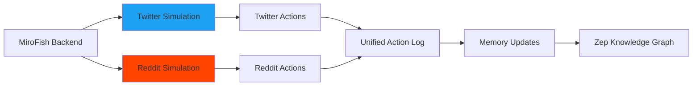
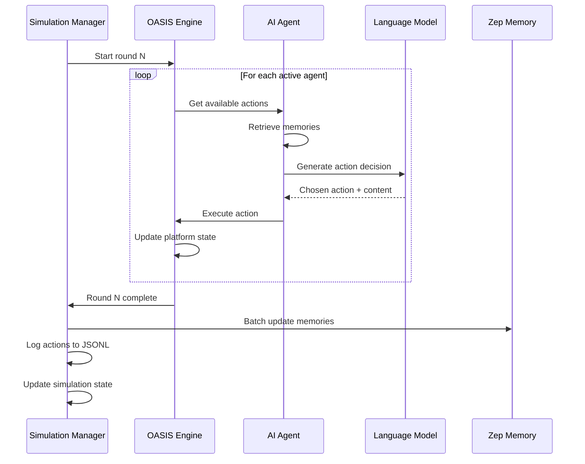

## Overview

MiroFish uses **OASIS** (Open Agent Social Interaction Simulation), an open-source multi-agent simulation framework developed by [CAMEL-AI](https://github.com/camel-ai/oasis), to create realistic social media environments where AI agents interact.

<Info>
OASIS provides the **physics engine** for social dynamics - handling post visibility, recommendation algorithms, temporal progression, and action execution. MiroFish adds the **intelligence layer** - detailed agent personas, dynamic memory, and graph-based knowledge.
</Info>

## How OASIS Simulation Works

### Dual-Platform Architecture

MiroFish runs **two platforms in parallel**:



<CardGroup cols={2}>
  <Card title="Twitter" icon="x-twitter">
    **Features**:
    - Create tweets (280 char limit)
    - Reply to tweets
    - Retweet and quote-tweet
    - Like tweets
    - Follow users
    - Timeline algorithm
    
    **Good for**: Rapid information spread, opinion leaders, viral cascades
  </Card>
  
  <Card title="Reddit" icon="reddit">
    **Features**:
    - Create posts in subreddits
    - Comment on posts
    - Upvote/downvote content
    - Nested comment threads
    - Community-based visibility
    
    **Good for**: Deep discussions, community dynamics, threaded debates
  </Card>
</CardGroup>

### Simulation Loop

From `simulation_runner.py:196-230`, each round follows this cycle:



<Steps>
  <Step title="Agent Activation">
    Based on the current simulated hour and agent's `active_hours`, determine which agents are active.
    
    ```python
    # From simulation_config_generator.py:84-109
    current_hour = (start_hour + round_num * minutes_per_round // 60) % 24
    
    if current_hour in agent.active_hours:
        activity_prob = agent.activity_level
    else:
        activity_prob = 0.1  # Low activity outside active hours
    ```
  </Step>
  
  <Step title="Observation">
    Each active agent observes:
    - Posts from accounts they follow
    - Trending posts (based on engagement)
    - Replies to their own posts
    - Recommended content (based on platform algorithm)
  </Step>
  
  <Step title="Decision Making">
    Agent uses its persona + recent memories + observed content to decide:
    - **Should I post?** (Based on `posts_per_hour` config)
    - **Should I comment?** (If relevant content observed)
    - **Should I like/retweet?** (If content aligns with stance)
    - **Should I lurk?** (Do nothing this round)
    
    The LLM generates the actual content based on the agent's personality.
  </Step>
  
  <Step title="Action Execution">
    OASIS executes the action:
    - Creates post/comment in platform database
    - Updates follower timelines
    - Calculates engagement metrics
    - Triggers notifications
  </Step>
  
  <Step title="Memory Recording">
    After the round, agent's actions and observations are synced to Zep:
    ```python
    memory_update = {
        "entity_uuid": agent.entity_uuid,
        "observations": [
            "Saw @bob's tweet criticizing policy X",
            "Noticed trending hashtag #ReformNow"
        ],
        "actions": [
            "Posted: I agree with @bob's concerns..."
        ]
    }
    ```
  </Step>
</Steps>

## Agent Profiles and Personalities

### Profile Generation Process

Location: `backend/app/services/oasis_profile_generator.py`

MiroFish generates **highly detailed agent profiles** to ensure realistic behavior:

<Tabs>
  <Tab title="Individual Entities">
    For entities like students, professors, journalists:
    
    **Generated fields**:
    ```json
    {
      "user_id": 0,
      "username": "alice_wu_487",
      "name": "Alice Wu",
      "bio": "PhD student in Computer Science at Wuhan University. Research interests: AI ethics, machine learning fairness. Passionate about education reform. Views are my own.",
      "persona": "Alice Wu is a 26-year-old PhD student...\n\n[2000+ character detailed persona including:]\n- Education background and research focus\n- Relationship to the event/issue\n- Personality traits (MBTI: INFJ)\n- Social media behavior (posts 2-3 times daily, active 9am-11pm)\n- Language style (academic but accessible, uses data to support claims)\n- Stance and values (progressive, emphasizes fairness and transparency)\n- Past experiences that shape current views\n- Emotional triggers (injustice, dismissive authority figures)\n- Personal memories related to the event",
      "age": 26,
      "gender": "female",
      "mbti": "INFJ",
      "country": "China",
      "profession": "PhD Student",
      "interested_topics": ["AI Ethics", "Education Reform", "Academic Integrity"],
      "karma": 3420,
      "follower_count": 580,
      "friend_count": 290
    }
    ```
  </Tab>
  
  <Tab title="Organizational Entities">
    For entities like universities, media outlets, government agencies:
    
    **Generated fields**:
    ```json
    {
      "user_id": 15,
      "username": "whu_official_921",
      "name": "Wuhan University",
      "bio": "Official account of Wuhan University. Established 1893. Committed to academic excellence and student development. 📚🎓",
      "persona": "Wuhan University's official account represents...\n\n[2000+ character institutional persona including:]\n- Institution history and mission\n- Official communication style (formal, measured, cautious)\n- Posting schedule (business hours, announcements)\n- Crisis communication approach (acknowledge → investigate → respond)\n- Relationship to stakeholders (students, faculty, alumni, government)\n- Past institutional responses to similar events\n- Organizational memory of the current situation",
      "age": 30,  // Symbolic age for organizations
      "gender": "other",
      "mbti": "ISTJ",  // Institutional personality archetype
      "country": "China",
      "profession": "University",
      "interested_topics": ["Higher Education", "Research", "Student Affairs"]
    }
    ```
    
    Note: Organizations use `"other"` for gender and symbolic attributes to distinguish from individuals.
  </Tab>
</Tabs>

### Persona Enrichment with Zep Context

From `oasis_profile_generator.py:413-486`, before generating the persona, MiroFish:

1. **Retrieves entity's direct relationships** from the knowledge graph
2. **Searches Zep for related facts** using hybrid search (full-text + semantic)
3. **Fetches summaries of connected entities** to understand social context
4. **Combines all context** into a rich prompt for the LLM

Example context for agent "Alice Wu":
```markdown
### Entity Attributes
- major: Computer Science
- year: PhD candidate (3rd year)

### Related Facts and Relationships
- Alice Wu studies at Wuhan University
- Alice Wu is advised by Professor Chen
- Alice Wu co-authored paper with Bob Li on AI fairness
- Alice Wu posted criticism of university policy on March 10

### Related Entities
- **Professor Chen** (Professor): Senior faculty in CS department, known for supportive mentorship
- **Bob Li** (Student): Fellow PhD student, close collaborator
- **Wuhan University** (University): Prestigious institution, recently faced controversy

### Zep Retrieved Facts
- Alice participated in student council meetings about academic policies
- Alice received university scholarship for research excellence
- Alice's research focuses on algorithmic fairness in education systems
```

This rich context ensures the generated persona is **grounded in the knowledge graph** rather than generic.

## Memory Systems and Temporal Dynamics

### Multi-Level Memory Architecture

MiroFish implements a **three-tier memory system**:

<Tabs>
  <Tab title="Short-Term (Working) Memory">
    **Scope**: Current simulation round
    
    **Content**: 
    - Posts observed this round
    - Immediate emotional reactions
    - Active conversation threads
    
    **Implementation**: In-memory Python objects, cleared after round
    
    **Purpose**: Decides immediate actions ("I just saw an outrageous tweet, must respond now")
  </Tab>
  
  <Tab title="Medium-Term (Episodic) Memory">
    **Scope**: Recent simulation history (last 24 simulated hours)
    
    **Content**:
    - My recent posts and their reception
    - Conversations I participated in
    - Trending topics I noticed
    
    **Implementation**: OASIS internal storage, accessed via agent memory API
    
    **Purpose**: Provides continuity ("I already posted about this yesterday, no need to repeat")
  </Tab>
  
  <Tab title="Long-Term (Semantic) Memory">
    **Scope**: Entire pre-simulation history + accumulated simulation memories
    
    **Content**:
    - Core beliefs and values (from persona)
    - Past experiences (from knowledge graph)
    - Updated beliefs from simulation events
    - Social relationships and reputation
    
    **Implementation**: Zep Cloud knowledge graph
    
    **Purpose**: Defines identity ("As someone who experienced X in the past, I believe Y")
  </Tab>
</Tabs>

### Memory Update Mechanism

From `zep_graph_memory_updater.py`, after each simulation round:

```python
class ZepGraphMemoryManager:
    def update_memories_batch(self, memories: List[Dict]):
        """
        Batch update agent memories in Zep graph
        
        Each memory contains:
        - entity_uuid: Which agent
        - observations: What they saw
        - actions: What they did
        """
        for memory in memories:
            # Create Episode in Zep
            episode = EpisodeData(
                episode_uuid=f"sim_round_{round_num}_{agent_id}",
                content=f"""
                Observations:
                {memory['observations']}
                
                Actions:
                {memory['actions']}
                """,
                metadata={
                    "round": round_num,
                    "simulated_time": current_sim_time
                }
            )
            
            # Zep automatically:
            # 1. Extracts new facts
            # 2. Updates entity summaries
            # 3. Creates temporal edges
            # 4. Builds semantic embeddings
```

This creates a **temporal knowledge graph** where:
- Entity nodes accumulate updated summaries
- New relationship edges capture evolved connections
- Temporal queries can retrieve "What did Alice know on Day 2?"

### Temporal Progression

From `simulation_config_generator.py:83-109`, time in MiroFish follows **real-world rhythms**:

<CodeGroup>
```python Time Configuration
@dataclass
class TimeSimulationConfig:
    # Simulate 72 hours (3 days) by default
    total_simulation_hours: int = 72
    
    # Each round = 60 simulated minutes
    minutes_per_round: int = 60
    
    # Activity patterns based on China timezone
    peak_hours: List[int] = [19, 20, 21, 22]  # Evening
    peak_activity_multiplier: float = 1.5
    
    off_peak_hours: List[int] = [0, 1, 2, 3, 4, 5]  # Late night
    off_peak_activity_multiplier: float = 0.05
    
    morning_hours: List[int] = [6, 7, 8]
    morning_activity_multiplier: float = 0.4
    
    work_hours: List[int] = [9-18]
    work_activity_multiplier: float = 0.7
```

```python Activity Calculation
def calculate_active_agents(current_hour, total_agents):
    base_activity = 0.3  # 30% of agents might be active
    
    if current_hour in peak_hours:
        multiplier = 1.5  # 45% active in evening
    elif current_hour in off_peak_hours:
        multiplier = 0.05  # 1.5% active at 3am
    elif current_hour in morning_hours:
        multiplier = 0.4  # 12% active in morning
    else:
        multiplier = 0.7  # 21% active during work hours
    
    return int(total_agents * base_activity * multiplier)
```
</CodeGroup>

This creates **realistic daily rhythms**:
- Low activity overnight (agents "sleeping")
- Gradual increase in morning
- Moderate activity during work hours
- Peak activity 7-10pm (when people check social media after work)

### Example Timeline

| Sim Time | Round | Activity Level | Typical Actions |
|----------|-------|----------------|------------------|
| Day 1, 9am | 1 | Medium | Initial reactions to triggering event |
| Day 1, 12pm | 4 | Medium | Lunchtime discussions, article sharing |
| Day 1, 8pm | 12 | **High** | Evening peak, opinion leaders post |
| Day 1, 2am | 18 | **Very Low** | Only night owls active |
| Day 2, 9am | 25 | Medium | Fresh perspectives, new information |
| Day 2, 8pm | 36 | **High** | Continued debate, emerging narratives |
| Day 3, 9am | 49 | Medium | Fatigue sets in, tone shifts |
| Day 3, 8pm | 60 | High | Consensus forming or polarization |

## Platform Simulation Details

### Twitter Mechanics

<AccordionGroup>
  <Accordion title="Timeline Algorithm" icon="newspaper">
    Twitter timeline shows posts based on:
    ```python
    def calculate_tweet_score(tweet, viewer):
        # Recency: Newer tweets ranked higher
        recency_score = 1.0 / (hours_since_post + 1)
        
        # Popularity: Engagement boosts visibility
        popularity_score = (
            tweet.likes * 1.0 +
            tweet.retweets * 2.0 +
            tweet.replies * 1.5
        )
        
        # Relevance: Match viewer interests
        relevance_score = cosine_similarity(
            viewer.interests,
            tweet.topics
        )
        
        return (
            0.4 * recency_score +
            0.3 * popularity_score +
            0.3 * relevance_score
        )
    ```
    
    Configurable via `PlatformConfig` in simulation parameters.
  </Accordion>
  
  <Accordion title="Viral Threshold" icon="fire">
    When a tweet reaches the viral threshold (default: 10 engagements), it:
    - Appears in "Trending" feed
    - Shown to users who don't follow the author
    - Triggers recommendation cascade
    
    This models **information cascades** where popular content becomes more popular.
  </Accordion>
  
  <Accordion title="Action Types" icon="bolt">
    Agents can:
    - `CREATE_POST`: Original tweet (up to 280 chars)
    - `REPLY`: Reply to existing tweet
    - `RETWEET`: Share tweet to followers
    - `QUOTE_TWEET`: Retweet with comment
    - `LIKE`: Boost engagement score
    - `FOLLOW`: Subscribe to user's posts
  </Accordion>
</AccordionGroup>

### Reddit Mechanics

<AccordionGroup>
  <Accordion title="Subreddit System" icon="comments">
    Posts are organized into subreddits (communities):
    - Agents can subscribe to relevant subreddits
    - Each subreddit has its own culture and norms
    - Moderators (designated agents) can pin posts
    
    MiroFish auto-generates subreddits based on topics in the knowledge graph.
  </Accordion>
  
  <Accordion title="Upvote/Downvote Dynamics" icon="arrow-up">
    Content visibility is determined by **net score**:
    ```python
    post_score = upvotes - downvotes
    
    # Hot ranking algorithm
    hot_score = log(max(post_score, 1)) - (hours_since_post / 12)
    ```
    
    - Upvoted content rises to the top
    - Downvoted content gets hidden
    - Controversial posts (many votes, low net score) may be highlighted
  </Accordion>
  
  <Accordion title="Threaded Discussions" icon="sitemap">
    Reddit supports nested comment threads:
    - Agents can reply to specific comments
    - Creates branching conversation trees
    - Allows nuanced multi-party debates
    
    Useful for simulating **complex deliberation** vs. Twitter's flatter structure.
  </Accordion>
</AccordionGroup>

## Simulation Configuration

### Agent Activity Configuration

From `simulation_config_generator.py:50-79`, each agent has:

```python
@dataclass
class AgentActivityConfig:
    agent_id: int
    entity_name: str
    
    # How active overall (0.0 to 1.0)
    activity_level: float = 0.5
    
    # Posting frequency
    posts_per_hour: float = 1.0
    comments_per_hour: float = 2.0
    
    # When agent is active (24-hour format)
    active_hours: List[int] = [8, 9, 10, ..., 22, 23]
    
    # Response timing
    response_delay_min: int = 5  # minutes
    response_delay_max: int = 60
    
    # Emotional baseline
    sentiment_bias: float = 0.0  # -1 (negative) to +1 (positive)
    
    # Opinion on key issue
    stance: str = "neutral"  # supportive / opposing / neutral / observer
    
    # Influence (affects visibility)
    influence_weight: float = 1.0
```

These are **automatically generated by LLM** based on:
- Entity type (professors more authoritative, students more emotional)
- Entity summary from knowledge graph
- Simulation requirements (if you want to model crisis escalation, bias toward opposing stances)

### Event Configuration

From `simulation_config_generator.py:112-125`:

```python
@dataclass
class EventConfig:
    # Initial posts at simulation start
    initial_posts: List[Dict[str, Any]] = [
        {
            "poster_agent_id": 5,
            "platform": "twitter",
            "content": "BREAKING: University announces policy change...",
            "scheduled_round": 0
        }
    ]
    
    # Scheduled events during simulation
    scheduled_events: List[Dict[str, Any]] = [
        {
            "trigger_round": 24,  # After 24 hours
            "event_type": "official_statement",
            "agent_id": 15,  # University official account
            "content": "After careful review..."
        }
    ]
    
    # Hot topics to monitor
    hot_topics: List[str] = [
        "academic integrity",
        "university policy",
        "student rights"
    ]
```

This allows **intervention testing**: "What if the university responds after 12 hours vs. 48 hours?"

## Action Logging and Analysis

Every agent action is logged to `actions.jsonl`:

```json
{"round": 1, "timestamp": "2024-03-10T09:00:00", "platform": "twitter", "agent_id": 3, "agent_name": "Alice Wu", "action_type": "CREATE_POST", "action_args": {"content": "Very concerned about recent developments..."}, "result": "tweet_id_12345", "success": true}
{"round": 1, "timestamp": "2024-03-10T09:05:00", "platform": "twitter", "agent_id": 7, "agent_name": "Bob Li", "action_type": "LIKE", "action_args": {"tweet_id": "tweet_id_12345"}, "success": true}
{"round": 2, "timestamp": "2024-03-10T10:00:00", "platform": "twitter", "agent_id": 7, "agent_name": "Bob Li", "action_type": "REPLY", "action_args": {"tweet_id": "tweet_id_12345", "content": "I completely agree with @alice_wu..."}, "result": "tweet_id_12346", "success": true}
```

This enables:
- **Replay**: Reconstruct the entire simulation timeline
- **Analysis**: Which agents were most influential?
- **Debugging**: Why did a cascade occur at round 15?
- **Visualization**: Generate network graphs of information flow

## Performance Considerations

<Warning>
Running 100+ LLM-powered agents is computationally intensive:
</Warning>

**Typical costs for a 72-hour simulation**:
- 100 agents
- 72 rounds
- Average 30 agents active per round
- 2 LLM calls per active agent (decision + content generation)
- Total: ~4,320 LLM calls

At Alibaba Qwen-plus pricing (~$0.001 per call), this costs approximately **$4-5 per simulation**.

**Optimization strategies**:
1. **Reduce agent count**: Use 30-50 agents for rapid iteration
2. **Shorter simulations**: Test with 24-hour simulations initially
3. **Action caching**: Cache similar decisions across agents
4. **Batch LLM calls**: Process multiple agents in parallel
5. **Cheaper models**: Use faster models (Qwen-turbo) for routine actions, save premium models for complex decisions

## Next Steps

<CardGroup cols={2}>
  <Card title="Run a Simulation" icon="play" href="/guides/running-simulations">
    Step-by-step guide to launching your first simulation
  </Card>
  
  <Card title="Configuration Guide" icon="sliders" href="/configuration/environment-variables">
    Customize agent behaviors and simulation parameters
  </Card>
  
  <Card title="Analysis Tools" icon="chart-line" href="/guides/generating-reports">
    Analyze action logs and extract insights
  </Card>
  
  <Card title="API Reference" icon="code" href="/api/simulation">
    Simulation API endpoints
  </Card>
</CardGroup>