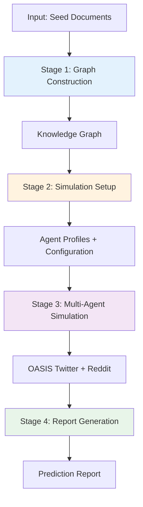
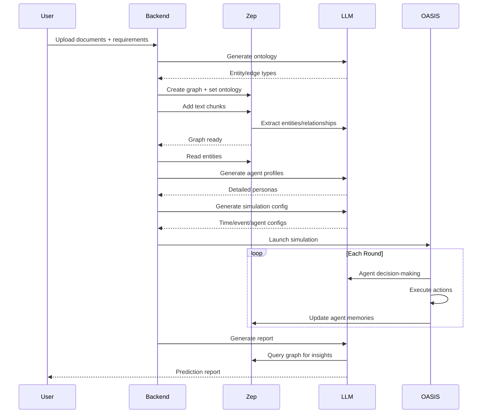

## Introduction

MiroFish is a next-generation AI prediction engine built on multi-agent technology. It extracts seed information from the real world (breaking news, policy drafts, financial signals) and automatically constructs a high-fidelity parallel digital world. Within this space, thousands of intelligent agents with independent personalities, long-term memory, and behavioral logic interact and evolve socially.

## System Architecture

MiroFish follows a three-stage pipeline architecture:

### Core Components

MiroFish consists of four major architectural layers:

<CardGroup cols={2}>
  <Card title="Knowledge Layer" icon="brain">
    GraphRAG-powered knowledge extraction and ontology generation using **Zep Cloud** for graph storage and retrieval
  </Card>
  <Card title="Agent Layer" icon="users">
    Intelligent agent profile generation with detailed personas, memories, and behavioral patterns
  </Card>
  <Card title="Simulation Layer" icon="network-wired">
    Dual-platform social media simulation (**Twitter + Reddit**) powered by the **OASIS** engine
  </Card>
  <Card title="Analysis Layer" icon="chart-line">
    ReACT-pattern report generation with deep interaction capabilities and prediction insights
  </Card>
</CardGroup>

## Data Flow and Processing Pipeline

### 1. Graph Building Phase

**Input**: Raw text documents, simulation requirements

**Process**:
- **Ontology Generation** (`ontology_generator.py:172-206`): LLM analyzes documents to design entity types and relationship types suitable for social simulation
- **Text Processing**: Documents are chunked (default 500 chars, 50 overlap) for efficient processing
- **GraphRAG Extraction**: Zep Cloud extracts entities, relationships, and facts using the defined ontology
- **Graph Storage**: Standalone knowledge graph stored in Zep Cloud with full-text search and semantic retrieval

**Output**: Graph ID, node count, edge count, entity types

### 2. Environment Setup Phase

**Input**: Graph ID, entity list

**Process**:
- **Entity Filtering** (`zep_entity_reader.py`): Reads entities from Zep graph with configurable filters
- **Profile Generation** (`oasis_profile_generator.py:216-273`): 
  - Retrieves rich context from Zep graph (facts, relationships, summaries)
  - LLM generates detailed personas (2000+ characters including background, personality, social media behavior)
  - Distinguishes between individual entities (students, experts) and organizational entities (universities, media)
- **Configuration Generation** (`simulation_config_generator.py`): LLM intelligently generates simulation parameters
  - Time simulation config (aligned with China timezone and activity patterns)
  - Agent activity configs (posting frequency, active hours, sentiment bias, stance)
  - Initial posts and scheduled events
  - Platform-specific parameters

**Output**: Agent profiles (JSON/CSV), simulation configuration files

### 3. Simulation Phase

**Input**: Agent profiles, simulation configuration

**Process**:
- **OASIS Initialization**: Dual-platform simulation environments (Twitter + Reddit) launched in parallel
- **Temporal Dynamics**: Time progresses in rounds (default: 60 simulated minutes per round)
- **Agent Actions**: Agents post, comment, like, share based on their personas and memory
- **Memory Updates**: Agent observations and actions are synced back to Zep graph in real-time
- **Platform Simulation**: 
  - **Twitter**: Tweet creation, replies, retweets, likes, following
  - **Reddit**: Post creation, comments, upvotes, subreddit interactions

**Output**: Action logs (JSONL), platform databases, updated agent memories

### 4. Reporting Phase

**Input**: Simulation ID, graph ID, simulation requirement

**Process**:
- **Report Agent** (`report_agent.py`): ReACT-pattern multi-turn reasoning
  - Plans report outline based on requirements
  - For each section:
    - Uses Zep tools (search, InsightForge, Panorama, Interview)
    - Reflects on retrieved information
    - Generates section with citations
  - Combines all sections into final report
- **Tool Integration**:
  - `search`: Full-text and semantic search across knowledge graph
  - `InsightForge`: Deep analysis of specific topics
  - `Panorama`: Global view of entity relationships
  - `Interview`: Conversation with specific entities

**Output**: Markdown report with predictions and analysis

## Key Technologies

### Zep Cloud

<Info>
Zep Cloud is the memory and knowledge graph backbone of MiroFish. Learn more at [getzep.com](https://www.getzep.com)
</Info>

**Capabilities used in MiroFish**:
- **Graph Memory**: Store and update agent memories during simulation
- **GraphRAG**: Extract entities and relationships from unstructured text
- **Hybrid Search**: Combine full-text and semantic search (RRF reranker)
- **Ontology Management**: Custom entity types and edge types
- **Temporal Queries**: Track how knowledge evolves over time

### OASIS

<Info>
OASIS is the multi-agent simulation engine powering MiroFish's social media environments. Developed by [CAMEL-AI](https://github.com/camel-ai/oasis)
</Info>

**Capabilities**:
- **Platform Simulation**: Twitter and Reddit environments with realistic mechanics
- **Agent Behavior**: LLM-powered agent decision-making
- **Scalability**: Supports hundreds of concurrent agents
- **Action Logging**: Detailed logs of every agent action

### LLM Integration

MiroFish supports any OpenAI-compatible LLM API:
- **Recommended**: Alibaba Qwen-plus (via Bailian platform)
- **Supported**: OpenAI, Azure OpenAI, local models (via vLLM/Ollama)

**LLM is used for**:
1. Ontology generation (designing entity/edge types)
2. Entity extraction (via Zep's GraphRAG)
3. Profile generation (creating detailed agent personas)
4. Configuration generation (setting simulation parameters)
5. Agent decision-making (during simulation)
6. Report generation (analyzing results)

## Component Interaction

## Workflow Summary

The complete MiroFish workflow as described in the README:

1. **Graph Construction**: Real-world seed extraction + individual/collective memory injection + GraphRAG construction
2. **Environment Setup**: Entity-relationship extraction + persona generation + agent injection with simulation parameters
3. **Start Simulation**: Dual-platform parallel simulation + automatic parsing of prediction needs + dynamic temporal memory updates
4. **Report Generation**: ReportAgent with rich toolset for deep interaction with the simulated environment
5. **Deep Interaction**: Chat with any agent in the simulated world + interact with ReportAgent

<Note>
Each phase is designed to be fully automated, requiring minimal human intervention. The system intelligently adapts parameters based on the input documents and requirements.
</Note>

## Next Steps

<CardGroup cols={2}>
  <Card title="Knowledge Graphs" icon="sitemap" href="/concepts/knowledge-graphs">
    Learn how GraphRAG extracts and organizes information
  </Card>
  <Card title="Swarm Intelligence" icon="brain-circuit" href="/concepts/swarm-intelligence">
    Understand collective behavior and emergence
  </Card>
  <Card title="Multi-Agent Simulation" icon="users-gear" href="/concepts/multi-agent-simulation">
    Deep dive into OASIS simulation mechanics
  </Card>
  <Card title="Quick Start" icon="rocket" href="/quickstart">
    Set up and run your first simulation
  </Card>
</CardGroup>