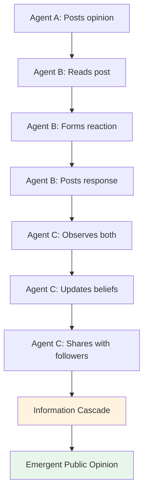
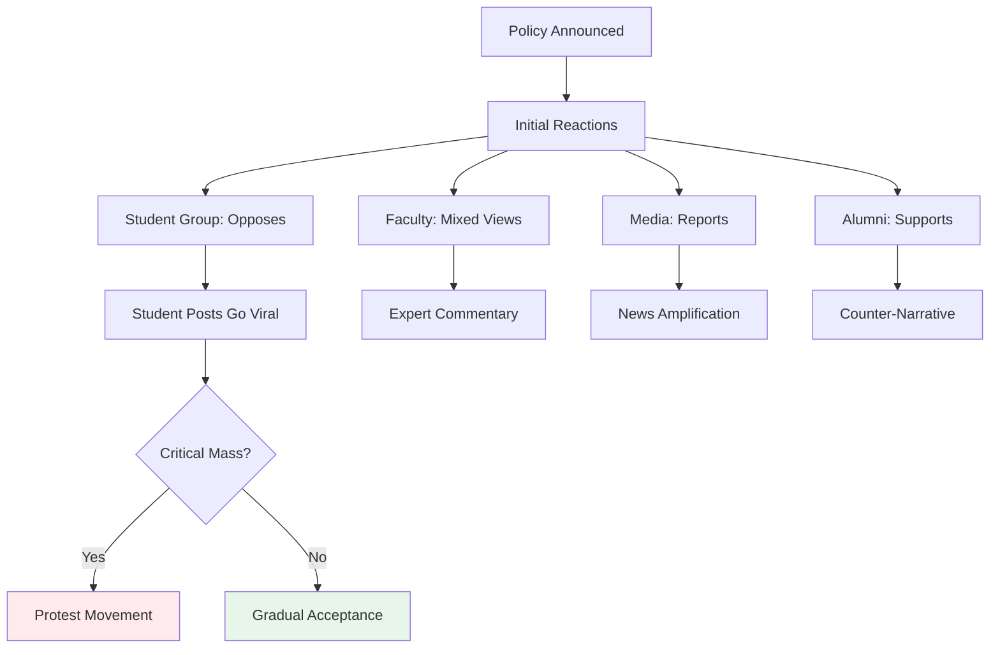
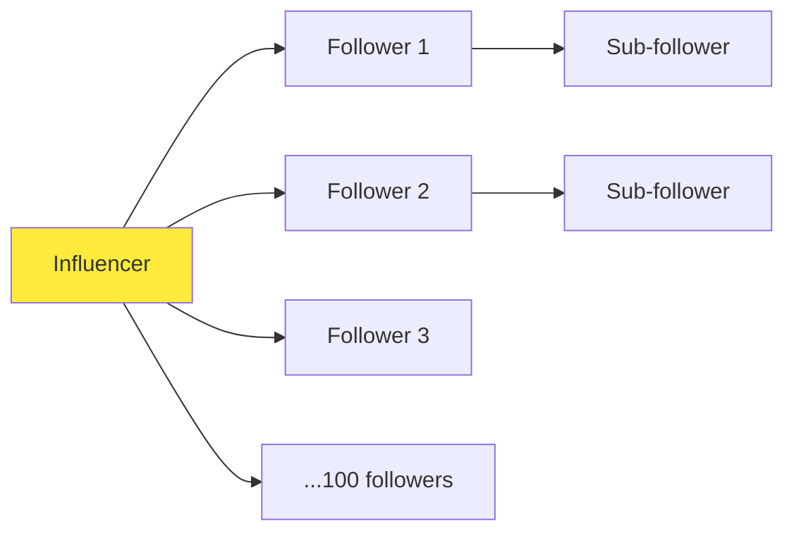

## What is Swarm Intelligence?

**Swarm intelligence** is a computational approach inspired by the collective behavior of decentralized, self-organized systems. In nature, we see it in:
- Ant colonies finding optimal food paths
- Bird flocks coordinating flight patterns
- Bee swarms making collective decisions
- Fish schools evading predators

In MiroFish, swarm intelligence refers to the **emergent patterns** that arise when hundreds of AI agents interact on simulated social media platforms. No central controller dictates behavior - each agent acts autonomously based on:
- Their individual personality and beliefs
- Their accumulated memories and experiences
- The information they observe from others
- The reactions they receive to their posts

## From Individual Behaviors to Collective Patterns

### The Emergence Mechanism



<Steps>
  <Step title="Individual Actions">
    Each agent independently decides whether to post, comment, or like based on their persona:
    - A student might post about academic concerns
    - A professor might respond with authoritative commentary
    - A media outlet might report on trending discussions
  </Step>
  
  <Step title="Local Interactions">
    Agents observe content from:
    - Accounts they follow
    - Trending topics on the platform
    - Replies to their own posts
    
    This creates **local influence networks** where opinions spread among connected agents.
  </Step>
  
  <Step title="Information Propagation">
    High-engagement content (many likes/retweets) becomes more visible:
    - Platform recommendation algorithms prioritize viral content
    - Echo chambers form around shared viewpoints
    - Opposing viewpoints may clash in comment threads
  </Step>
  
  <Step title="Collective Patterns">
    Over time, **macro-level patterns** emerge:
    - Public opinion trends in specific directions
    - Influential agents gain larger followings
    - Crisis events trigger coordinated responses
    - Misinformation may spread or be debunked
  </Step>
</Steps>

### Simple Rules, Complex Outcomes

MiroFish agents follow relatively simple rules:

<CodeGroup>
```python Agent Decision Logic
# Simplified pseudocode
class Agent:
    def decide_action(self, current_hour, observed_posts):
        # Rule 1: Activity based on time of day
        if current_hour in self.active_hours:
            base_activity = self.activity_level
        else:
            base_activity = 0.1  # Low activity during sleep hours
        
        # Rule 2: React to relevant content
        relevant_posts = [
            post for post in observed_posts 
            if self.is_relevant_to_interests(post)
        ]
        
        # Rule 3: Decide action type
        if self.should_create_post():
            return self.create_original_post()
        elif relevant_posts and self.should_engage():
            return self.react_to_post(choice(relevant_posts))
        else:
            return None  # Lurk
    
    def create_original_post(self):
        # Generate post based on:
        # - Current events (from simulation config)
        # - Personal stance and sentiment bias
        # - Recent memories and observations
        return self.llm_generate_post(
            persona=self.persona,
            context=self.recent_memories
        )
```

```python Engagement Decision
def should_engage(self, post):
    """Decide whether to engage with a post"""
    
    # Factor 1: Relevance to interests
    relevance = self.calculate_relevance(post)
    
    # Factor 2: Emotional response
    if self.stance == "supportive" and post.sentiment > 0:
        emotion_boost = 0.3
    elif self.stance == "opposing" and post.sentiment < 0:
        emotion_boost = 0.3
    else:
        emotion_boost = 0.0
    
    # Factor 3: Influence of poster
    if post.author in self.trusted_sources:
        influence_boost = 0.2
    else:
        influence_boost = 0.0
    
    engagement_score = (
        relevance + emotion_boost + influence_boost
    )
    
    return engagement_score > threshold
```
</CodeGroup>

Yet from these simple rules, **complex social dynamics** emerge:
- Opinion polarization
- Viral cascades
- Echo chamber formation
- Crisis escalation or de-escalation
- Misinformation spread patterns

## How Agent Interactions Create Predictions

### The Prediction Mechanism

MiroFish doesn't predict the future through statistical models or trend extrapolation. Instead, it **simulates the future** by letting agents interact naturally and observing the outcome.

<Tabs>
  <Tab title="Traditional Forecasting">
    **Linear extrapolation**:
    ```
    Past trend: 10% increase per month
    Prediction: 10% increase next month
    ```
    
    **Problems**:
    - Ignores tipping points
    - Can't model social contagion
    - No mechanism for novelty
    - Fails at phase transitions
  </Tab>
  
  <Tab title="MiroFish Approach">
    **Agent-based simulation**:
    ```
    1. Seed initial conditions (real-world state)
    2. Let agents interact for N rounds
    3. Observe emergent outcomes
    4. Analyze multiple simulation runs
    ```
    
    **Advantages**:
    - Captures non-linear dynamics
    - Models social influence naturally
    - Discovers unexpected pathways
    - Handles cascades and tipping points
  </Tab>
</Tabs>

### Emergence and Prediction

The key insight: **The future is an emergent property of present interactions.**

Consider a policy announcement:



**Traditional analysis** might say:
- 60% of surveyed people oppose the policy
- Therefore, likely protests

**MiroFish reveals**:
- Initial opposition is high, but...
- Key opinion leaders (professors) provide nuanced analysis
- Alumni support creates counter-pressure
- Media framing shifts the narrative
- After 48 simulated hours, opposition softens to 40%
- Protest likelihood: Low (unless a triggering incident occurs)

The simulation captures **dynamics** that surveys and polls miss.

## Why This Approach Works for Forecasting

### 1. Captures Social Contagion

Opinions spread like viruses through social networks:

<Card title="Threshold Models" icon="chart-network">
  Each agent has a **threshold** for changing their opinion:
  - Low threshold: Easily influenced ("followers")
  - High threshold: Strongly opinionated ("opinion leaders")
  
  When enough neighbors adopt a viewpoint, others follow:
  ```
  If (# of neighbors with opinion X) / (total neighbors) > threshold:
      Adopt opinion X
  ```
  
  This creates **cascading adoption** that traditional models can't capture.
</Card>

### 2. Models Network Effects

The structure of social connections matters:



- **Hub agents** (high follower count) can trigger large-scale shifts
- **Bridge agents** (connecting different communities) spread information across echo chambers
- **Peripheral agents** (few connections) have limited influence but can be early indicators

MiroFish's platform simulation (Twitter/Reddit) naturally models these network structures.

### 3. Handles Non-Linearity

<AccordionGroup>
  <Accordion title="Tipping Points" icon="scale-balanced">
    Small changes can trigger massive shifts:
    - One viral tweet can spark a movement
    - A key person changing sides can flip public opinion
    - Reaching 30% adoption often leads to rapid majority adoption
    
    MiroFish captures these **phase transitions** because agents respond to observed states, creating feedback loops.
  </Accordion>
  
  <Accordion title="Feedback Loops" icon="arrows-rotate">
    **Positive feedback** (amplification):
    - More engagement → More visibility → More engagement
    - Outrage generates counter-outrage
    
    **Negative feedback** (stabilization):
    - Extreme views get pushback
    - Fatigue reduces engagement over time
    
    Both types naturally emerge from agent interactions.
  </Accordion>
  
  <Accordion title="Path Dependence" icon="route">
    Early events shape later outcomes:
    - If media frames an issue negatively first, positive voices struggle
    - If supporters organize early, opposition may be silenced
    
    MiroFish simulations reveal **how different initial conditions** lead to different futures.
  </Accordion>
</AccordionGroup>

### 4. Incorporates Heterogeneity

Not all agents are the same:

| Agent Type | Activity Level | Influence | Stance Flexibility |
|------------|----------------|-----------|--------------------|
| Opinion Leaders | High | High | Low (strong beliefs) |
| Engaged Citizens | Medium | Medium | Medium |
| Casual Users | Low | Low | High (easily swayed) |
| Bots/Trolls | Very High | Variable | N/A (scripted) |

From `oasis_profile_generator.py:488-494`, MiroFish distinguishes:
- **Individual entities**: Specific people with unique backgrounds
- **Group entities**: Organizational accounts representing collectives

Each type behaves differently, creating **realistic diversity** in the simulated population.

### 5. Enables Counterfactual Analysis

MiroFish can answer "what if" questions:

<CodeGroup>
```python Scenario A: No Intervention
simulation.run(
    initial_conditions=current_state,
    events=[],
    rounds=72  # 3 days
)
# Result: Protest movement gains momentum
```

```python Scenario B: Official Response
simulation.run(
    initial_conditions=current_state,
    events=[
        {
            "time": 12,  # 12 hours in
            "agent": "UniversityOfficial",
            "action": "post_statement",
            "content": "We hear your concerns..."
        }
    ],
    rounds=72
)
# Result: Tensions de-escalate, moderate voices dominate
```

```python Scenario C: Viral Misinformation
simulation.run(
    initial_conditions=current_state,
    events=[
        {
            "time": 6,
            "agent": "AnonymousAccount",
            "action": "post_rumor",
            "content": "FALSE: University plans mass expulsions"
        }
    ],
    rounds=72
)
# Result: Panic spreads, situation escalates rapidly
```
</CodeGroup>

By running **multiple scenarios**, decision-makers can:
- Identify high-risk pathways
- Test intervention strategies
- Prepare contingency plans

## Limitations and Considerations

<Warning>
While powerful, swarm intelligence simulation has limitations:
</Warning>

<AccordionGroup>
  <Accordion title="Model Uncertainty" icon="question">
    **Challenge**: Agent behavior is driven by LLMs, which have inherent randomness.
    
    **Mitigation**: 
    - Run multiple simulations with different random seeds
    - Look for **robust patterns** that appear across runs
    - Report confidence intervals, not point predictions
  </Accordion>
  
  <Accordion title="Initial Conditions Sensitivity" icon="seedling">
    **Challenge**: Small errors in the starting state can lead to divergent outcomes.
    
    **Mitigation**:
    - Use high-quality, detailed seed documents
    - Validate agent profiles against real-world data
    - Test sensitivity by perturbing initial conditions
  </Accordion>
  
  <Accordion title="Simplified Social Physics" icon="atom">
    **Challenge**: Real human behavior is more complex than any model.
    
    **Reality Check**:
    - MiroFish captures **key dynamics** (influence, contagion, network effects)
    - It's not a perfect replica but a useful approximation
    - Use as a **scenario exploration tool**, not a crystal ball
  </Accordion>
  
  <Accordion title="Computational Cost" icon="server">
    **Challenge**: Simulating hundreds of LLM-powered agents is expensive.
    
    **Practical Approach**:
    - Use smaller agent populations for rapid iteration
    - Scale up for final production runs
    - Optimize LLM calls (caching, batching)
  </Accordion>
</AccordionGroup>

## Case Study: Wuhan University Sentiment Prediction

From the demo video mentioned in the README:

**Scenario**: Analyzing public opinion evolution after an academic integrity incident

**Setup**:
- Seed document: 50,000-character detailed report of the incident
- Entities extracted: 80+ stakeholders (students, faculty, administrators, media, alumni)
- Simulation duration: 72 hours (3 days)
- Platforms: Twitter + Reddit

**Initial State** (T=0):
- Student sentiment: 80% negative, 15% neutral, 5% positive
- Faculty sentiment: Mixed, awaiting investigation
- Media coverage: Neutral reporting

**Emergent Outcomes** (T=72):
- Student sentiment: 60% negative (softened due to official responses)
- Faculty sentiment: 40% supportive of reforms, 30% critical, 30% neutral
- Media narrative: Shifted to "systemic issues in academia" (broader framing)
- Key prediction: **No large-scale protests**, but sustained advocacy for policy changes

**Surprising Insight**:
A small group of alumni emerged as **bridge builders**, convincing students that "working within the system" was more effective than confrontation. This **bridge community** was not obvious from the initial data but emerged naturally from the simulation.

**Validation**:
Actual real-world outcome closely matched the simulation, with gradual reform advocacy rather than immediate protests.

## Next Steps

<CardGroup cols={2}>
  <Card title="Multi-Agent Simulation" icon="users-gear" href="/concepts/multi-agent-simulation">
    Learn the technical details of OASIS simulation
  </Card>
  <Card title="Knowledge Graphs" icon="sitemap" href="/concepts/knowledge-graphs">
    How agents build and use collective memory
  </Card>
  <Card title="Run a Simulation" icon="play" href="/guides/running-simulations">
    Step-by-step guide to running your first simulation
  </Card>
  <Card title="Analysis Tools" icon="chart-mixed" href="/guides/generating-reports">
    Tools for analyzing simulation results
  </Card>
</CardGroup>