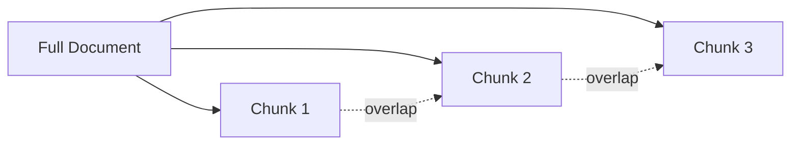

## Overview

The knowledge graph is the foundation of your simulation. It extracts entities and relationships from your documents, creating a rich network that simulates realistic agent behaviors and interactions.

## The Graph Building Process

<Steps>
  <Step title="Generate Ontology">
    First, upload your documents and let AI analyze them to generate an ontology:
    
    ```bash POST /api/graph/ontology/generate
    curl -X POST http://localhost:5000/api/graph/ontology/generate \
      -F "files=@policy_document.pdf" \
      -F "files=@student_handbook.md" \
      -F "simulation_requirement=Simulate student reactions to new campus policy" \
      -F "project_name=Campus Policy Simulation"
    ```
    
    The system will:
    1. Extract text from all uploaded documents
    2. Preprocess and clean the text
    3. Use LLM to analyze content and identify key entity types
    4. Define relationship types between entities
    5. Generate a complete ontology structure
    
    **Response includes:**
    ```json
    {
      "success": true,
      "data": {
        "project_id": "proj_xyz789",
        "ontology": {
          "entity_types": [
            {
              "name": "Student",
              "description": "University students affected by policies"
            },
            {
              "name": "Administrator",
              "description": "University administration officials"
            },
            {
              "name": "Policy",
              "description": "Campus policies and regulations"
            }
          ],
          "edge_types": [
            {
              "name": "SUPPORTS",
              "description": "Entity expresses support for another entity"
            },
            {
              "name": "OPPOSES",
              "description": "Entity expresses opposition to another entity"
            },
            {
              "name": "IMPLEMENTS",
              "description": "Administrator implements policy"
            }
          ]
        },
        "analysis_summary": "Analyzed 2 documents...",
        "total_text_length": 15432
      }
    }
    ```
  </Step>

  <Step title="Review Entity and Edge Types">
    Examine the generated ontology to understand what entities and relationships will be extracted:
    
    **Entity Types** represent actors and objects:
    - People (Students, Professors, Administrators)
    - Organizations (Departments, Clubs)
    - Concepts (Policies, Events, Topics)
    
    **Edge Types** represent relationships:
    - Social connections (FRIEND_OF, COLLEAGUE_OF)
    - Opinions (SUPPORTS, OPPOSES, NEUTRAL_ABOUT)
    - Actions (CREATES, IMPLEMENTS, PARTICIPATES_IN)
    
    The ontology is automatically optimized for your simulation requirements.
  </Step>

  <Step title="Build the Knowledge Graph">
    Once satisfied with the ontology, construct the knowledge graph:
    
    ```bash POST /api/graph/build
    curl -X POST http://localhost:5000/api/graph/build \
      -H "Content-Type: application/json" \
      -d '{
        "project_id": "proj_xyz789",
        "graph_name": "Campus Policy Network",
        "chunk_size": 500,
        "chunk_overlap": 50
      }'
    ```
    
    **Parameters:**
    - `project_id` (required): Your project ID from ontology generation
    - `graph_name` (optional): Descriptive name for the graph
    - `chunk_size` (optional): Text chunk size for processing (default: 500)
    - `chunk_overlap` (optional): Overlap between chunks (default: 50)
    - `force` (optional): Force rebuild if graph exists (default: false)
    
    **Response:**
    ```json
    {
      "success": true,
      "data": {
        "project_id": "proj_xyz789",
        "task_id": "task_build456",
        "message": "Graph building task started"
      }
    }
    ```
    
    Save the `task_id` to monitor progress!
  </Step>

  <Step title="Monitor Build Progress">
    Graph building is an asynchronous process. Monitor progress using the task ID:
    
    ```bash GET /api/graph/task/{task_id}
    curl http://localhost:5000/api/graph/task/task_build456
    ```
    
    **Progress Response:**
    ```json
    {
      "success": true,
      "data": {
        "task_id": "task_build456",
        "status": "processing",
        "progress": 45,
        "message": "Adding text chunks: 23/50",
        "created_at": "2024-12-10T10:00:00",
        "updated_at": "2024-12-10T10:05:30"
      }
    }
    ```
    
    **Status values:**
    - `pending`: Task queued but not started
    - `processing`: Graph is being built
    - `completed`: Graph construction successful
    - `failed`: An error occurred
    
    Poll this endpoint every 5-10 seconds until status is `completed`.
  </Step>

  <Step title="View Graph Data">
    Once building is complete, retrieve the graph data:
    
    ```bash GET /api/graph/data/{graph_id}
    curl http://localhost:5000/api/graph/data/mirofish_abc123
    ```
    
    The `graph_id` is returned in the task result when the build completes.
    
    **Response includes:**
    ```json
    {
      "success": true,
      "data": {
        "graph_id": "mirofish_abc123",
        "node_count": 156,
        "edge_count": 342,
        "nodes": [
          {
            "uuid": "node_123",
            "name": "John Smith",
            "labels": ["Student", "Entity"],
            "properties": {...}
          }
        ],
        "edges": [
          {
            "uuid": "edge_456",
            "source": "node_123",
            "target": "node_789",
            "name": "SUPPORTS"
          }
        ]
      }
    }
    ```
  </Step>
</Steps>

## Understanding the Build Process

### Text Chunking

Documents are split into chunks for efficient processing:

- **Chunk Size**: Number of characters per chunk (default: 500)
- **Chunk Overlap**: Characters shared between adjacent chunks (default: 50)
- Overlap ensures context continuity across chunk boundaries



### Entity Extraction

For each chunk, the system:

1. Identifies entities matching the ontology types
2. Extracts entity properties and attributes
3. Detects relationships between entities
4. Creates nodes and edges in the graph

### Graph Processing Stages

<AccordionGroup>
  <Accordion title="Stage 1: Initialization (0-10%)">
    - Connect to Zep graph service
    - Create new graph instance
    - Set ontology schema
  </Accordion>

  <Accordion title="Stage 2: Text Chunking (10-15%)">
    - Split document text into chunks
    - Apply overlap for context preservation
    - Prepare chunks for batch processing
  </Accordion>

  <Accordion title="Stage 3: Adding Text (15-55%)">
    - Upload chunks to Zep in batches
    - Extract entities and relationships
    - Create episodes for each chunk
    - Progress updated per batch
  </Accordion>

  <Accordion title="Stage 4: Processing (55-90%)">
    - Wait for Zep to process all episodes
    - Entity extraction and linking
    - Relationship inference
    - Graph structure optimization
  </Accordion>

  <Accordion title="Stage 5: Completion (90-100%)">
    - Retrieve final graph data
    - Calculate statistics
    - Save graph metadata
  </Accordion>
</AccordionGroup>

## Monitoring and Management

### List All Tasks

View all graph building tasks:

```bash GET /api/graph/tasks
curl http://localhost:5000/api/graph/tasks
```

### Force Rebuild

Rebuild a graph with different parameters:

```bash
curl -X POST http://localhost:5000/api/graph/build \
  -H "Content-Type: application/json" \
  -d '{
    "project_id": "proj_xyz789",
    "chunk_size": 1000,
    "chunk_overlap": 100,
    "force": true
  }'
```

### Delete Graph

Remove a graph from Zep:

```bash DELETE /api/graph/delete/{graph_id}
curl -X DELETE http://localhost:5000/api/graph/delete/mirofish_abc123
```

<Warning>
  Deleting a graph is permanent. Associated simulations will not be able to access the graph data.
</Warning>

## Optimizing Graph Quality

<CardGroup cols={2}>
  <Card title="Chunk Size">
    - **Smaller chunks (200-500)**: Better for dense, structured documents
    - **Larger chunks (800-1500)**: Better for narrative or conversational text
    - Default of 500 works well for most cases
  </Card>
  
  <Card title="Chunk Overlap">
    - **More overlap (100-200)**: Captures relationships spanning chunk boundaries
    - **Less overlap (20-50)**: Faster processing, less redundancy
    - Default of 50 balances performance and quality
  </Card>
</CardGroup>

## Troubleshooting

<AccordionGroup>
  <Accordion title="Build fails at initialization">
    - Check that `ZEP_API_KEY` is configured correctly
    - Verify network connectivity to Zep service
    - Ensure the project has a valid ontology
  </Accordion>

  <Accordion title="Build stalls during processing">
    - Zep processing can take time for large documents
    - Wait at least 5-10 minutes before considering it stuck
    - Check task status for error messages
  </Accordion>

  <Accordion title="Low entity count in graph">
    - Increase chunk size to provide more context
    - Review ontology - entity types may be too specific
    - Ensure documents contain rich entity information
  </Accordion>

  <Accordion title="Duplicate entities">
    - Zep automatically handles entity deduplication
    - Some duplicates are normal and will be merged
    - Provide consistent entity naming in documents
  </Accordion>
</AccordionGroup>

## Next Steps

<CardGroup cols={2}>
  <Card title="Run Simulations" icon="play" href="/guides/running-simulations">
    Use your knowledge graph to create and run simulations
  </Card>
  
  <Card title="Generate Reports" icon="chart-line" href="/guides/generating-reports">
    Analyze simulation results with AI-generated reports
  </Card>
</CardGroup>
