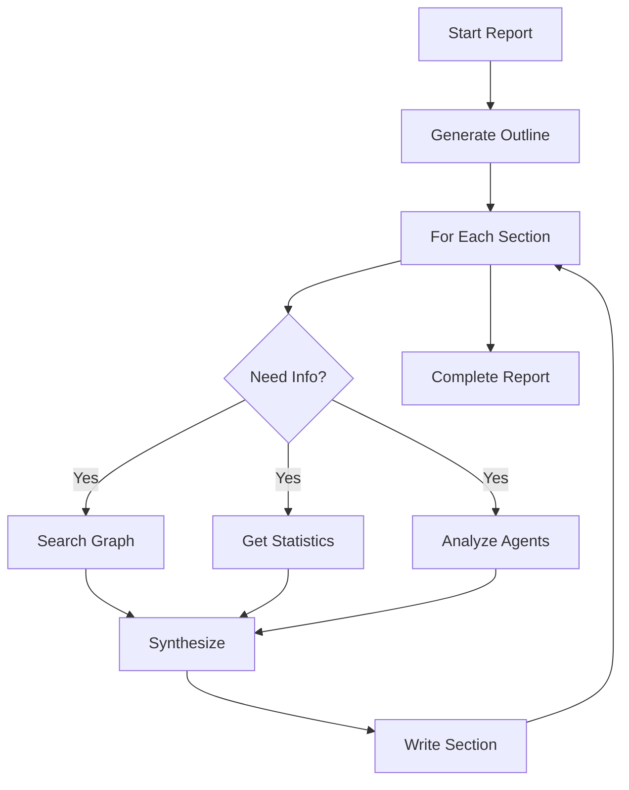

## Overview

MiroFish's Report Agent analyzes your simulation results and generates comprehensive prediction reports with insights, trends, and actionable findings. The agent autonomously searches the knowledge graph, analyzes agent interactions, and synthesizes findings into structured reports.

## Generating a Report

<Steps>
  <Step title="Start Report Generation">
    Create a new report for a completed simulation:
    
    ```bash POST /api/report/generate
    curl -X POST http://localhost:5000/api/report/generate \
      -H "Content-Type: application/json" \
      -d '{
        "simulation_id": "sim_abc123",
        "force_regenerate": false
      }'
    ```
    
    **Parameters:**
    - `simulation_id` (required): ID of the completed simulation
    - `force_regenerate` (optional): Force regenerate if report exists (default: false)
    
    **Response:**
    ```json
    {
      "success": true,
      "data": {
        "simulation_id": "sim_abc123",
        "report_id": "report_xyz789",
        "task_id": "task_report456",
        "status": "generating",
        "message": "Report generation task started"
      }
    }
    ```
    
    Save the `report_id` and `task_id`!
  </Step>

  <Step title="Monitor Generation Progress">
    Track the report generation progress:
    
    ```bash POST /api/report/generate/status
    curl -X POST http://localhost:5000/api/report/generate/status \
      -H "Content-Type: application/json" \
      -d '{
        "task_id": "task_report456",
        "simulation_id": "sim_abc123"
      }'
    ```
    
    **Progress Response:**
    ```json
    {
      "success": true,
      "data": {
        "task_id": "task_report456",
        "status": "processing",
        "progress": 35,
        "message": "[Section 2/6] Generating: Key Findings",
        "started_at": "2024-12-10T16:00:00",
        "updated_at": "2024-12-10T16:05:30"
      }
    }
    ```
    
    Poll every 5-10 seconds until `status` is `completed`.
  </Step>

  <Step title="View Generated Sections (Optional)">
    View sections as they're being generated in real-time:
    
    ```bash GET /api/report/{report_id}/sections
    curl http://localhost:5000/api/report/report_xyz789/sections
    ```
    
    **Response:**
    ```json
    {
      "success": true,
      "data": {
        "report_id": "report_xyz789",
        "sections": [
          {
            "filename": "section_01.md",
            "section_index": 1,
            "content": "## Executive Summary\n\nBased on the simulation..."
          },
          {
            "filename": "section_02.md",
            "section_index": 2,
            "content": "## Simulation Background\n\nThe simulation focused on..."
          }
        ],
        "total_sections": 2,
        "is_complete": false
      }
    }
    ```
    
    This allows showing partial results to users before the full report is complete.
  </Step>

  <Step title="Retrieve Complete Report">
    Once generation is complete, fetch the full report:
    
    ```bash GET /api/report/{report_id}
    curl http://localhost:5000/api/report/report_xyz789
    ```
    
    **Response:**
    ```json
    {
      "success": true,
      "data": {
        "report_id": "report_xyz789",
        "simulation_id": "sim_abc123",
        "status": "completed",
        "outline": {
          "sections": [
            {"title": "Executive Summary", "description": "High-level overview..."},
            {"title": "Simulation Background", "description": "Context and setup..."},
            {"title": "Key Findings", "description": "Major discoveries..."},
            {"title": "Trend Analysis", "description": "Patterns over time..."},
            {"title": "Sentiment Breakdown", "description": "Opinion distribution..."},
            {"title": "Recommendations", "description": "Actionable insights..."}
          ]
        },
        "markdown_content": "# Simulation Analysis Report\n\n## Executive Summary...",
        "created_at": "2024-12-10T16:00:00",
        "completed_at": "2024-12-10T16:15:00"
      }
    }
    ```
  </Step>

  <Step title="Download Report">
    Download the report as a Markdown file:
    
    ```bash GET /api/report/{report_id}/download
    curl -O http://localhost:5000/api/report/report_xyz789/download
    ```
    
    This downloads a `.md` file containing the full report with formatting.
  </Step>
</Steps>

## Understanding Report Structure

### Standard Report Sections

Reports typically include these sections:

<AccordionGroup>
  <Accordion title="1. Executive Summary">
    **Purpose**: High-level overview of findings
    
    **Contains:**
    - Simulation objectives and context
    - Top 3-5 key findings
    - Overall sentiment distribution
    - Critical insights requiring attention
    
    **Example:**
    > "The simulation of 68 student agents over 7 days revealed strong opposition (62%) to the proposed curfew policy, with significant concerns about personal freedom and academic flexibility."
  </Accordion>

  <Accordion title="2. Simulation Background">
    **Purpose**: Context and methodology
    
    **Contains:**
    - Simulation parameters and duration
    - Number and types of agents
    - Initial conditions and events
    - Platform(s) simulated
    
    **Example:**
    > "This simulation involved 68 agents (45 students, 15 professors, 8 administrators) over a simulated 168-hour period on Reddit and Twitter platforms."
  </Accordion>

  <Accordion title="3. Key Findings">
    **Purpose**: Major discoveries and insights
    
    **Contains:**
    - Primary patterns and behaviors observed
    - Unexpected outcomes
    - Significant agent interactions
    - Important quotes and examples
    
    **Example:**
    > "Finding 1: Student opposition intensified after hour 24, when Professor agents began defending the policy, creating a clear divide between faculty and students."
  </Accordion>

  <Accordion title="4. Trend Analysis">
    **Purpose**: Patterns over time
    
    **Contains:**
    - Temporal evolution of sentiment
    - Activity peaks and valleys
    - Viral cascade patterns
    - Influence propagation
    
    **Example:**
    > "Sentiment shifted from 40% opposition (hours 0-24) to 62% opposition (hours 144-168), indicating growing negative consensus over time."
  </Accordion>

  <Accordion title="5. Sentiment Breakdown">
    **Purpose**: Detailed opinion distribution
    
    **Contains:**
    - Sentiment by entity type
    - Support/oppose/neutral percentages
    - Reasoning categories
    - Influential voices
    
    **Example:**
    > "Students: 72% oppose, 15% support, 13% neutral  
    > Professors: 53% support, 27% oppose, 20% neutral  
    > Administrators: 87% support, 7% oppose, 6% neutral"
  </Accordion>

  <Accordion title="6. Recommendations">
    **Purpose**: Actionable insights
    
    **Contains:**
    - Strategic recommendations
    - Risk mitigation strategies
    - Communication opportunities
    - Areas requiring attention
    
    **Example:**
    > "Recommendation 1: Address student concerns about academic flexibility early in the policy announcement to prevent sentiment deterioration."
  </Accordion>
</AccordionGroup>

## How the Report Agent Works

### Autonomous Research Process

The Report Agent uses multiple tools to gather information:



### Available Research Tools

<CardGroup cols={2}>
  <Card title="Graph Search" icon="magnifying-glass">
    Searches the knowledge graph for entities, relationships, and facts relevant to the query.
    
    **Example use:**
    "Find all students who opposed the policy"
  </Card>
  
  <Card title="Graph Statistics" icon="chart-simple">
    Retrieves quantitative data about the graph structure, entity counts, and relationship distributions.
    
    **Example use:**
    "Get total agent count by type"
  </Card>
  
  <Card title="Simulation Data" icon="database">
    Accesses simulation logs, agent actions, posts, replies, and interaction patterns.
    
    **Example use:**
    "Retrieve all posts from hours 48-72"
  </Card>
  
  <Card title="Insight Forge" icon="lightbulb">
    Synthesizes multiple data points into insights, identifying patterns and anomalies.
    
    **Example use:**
    "Identify sentiment trends over time"
  </Card>
</CardGroup>

## Viewing Report Progress Details

### Real-time Progress Tracking

Get detailed progress information:

```bash GET /api/report/{report_id}/progress
curl http://localhost:5000/api/report/report_xyz789/progress
```

**Response:**
```json
{
  "success": true,
  "data": {
    "status": "generating",
    "progress": 45,
    "message": "Generating section: Key Findings",
    "current_section": "Key Findings",
    "completed_sections": ["Executive Summary", "Simulation Background"],
    "updated_at": "2024-12-10T16:05:30"
  }
}
```

### Agent Execution Log

View detailed tool calls and reasoning:

```bash GET /api/report/{report_id}/agent-log
curl http://localhost:5000/api/report/report_xyz789/agent-log?from_line=0
```

**Response:**
```json
{
  "success": true,
  "data": {
    "logs": [
      {
        "timestamp": "2024-12-10T16:01:23",
        "elapsed_seconds": 12.5,
        "action": "tool_call",
        "stage": "generating",
        "section_title": "Key Findings",
        "section_index": 3,
        "details": {
          "tool_name": "search_graph",
          "parameters": {
            "query": "students opposing curfew policy",
            "limit": 20
          },
          "result_summary": "Found 28 matching entities"
        }
      }
    ],
    "total_lines": 25,
    "from_line": 0,
    "has_more": false
  }
}
```

Use `from_line` parameter for incremental updates.

### Console Output Log

View formatted console-style logs:

```bash GET /api/report/{report_id}/console-log
curl http://localhost:5000/api/report/report_xyz789/console-log
```

**Response:**
```json
{
  "success": true,
  "data": {
    "logs": [
      "[16:01:15] INFO: Starting report generation",
      "[16:01:16] INFO: Outline created with 6 sections",
      "[16:01:20] INFO: Section 1/6: Executive Summary - Starting",
      "[16:01:23] INFO: Tool call: search_graph - Found 15 relevant facts",
      "[16:01:45] INFO: Section 1/6: Executive Summary - Completed"
    ],
    "total_lines": 5,
    "has_more": true
  }
}
```

## Managing Reports

### List All Reports

View all generated reports:

```bash GET /api/report/list?limit=50
curl http://localhost:5000/api/report/list?limit=50
```

### Get Report by Simulation

Find the report for a specific simulation:

```bash GET /api/report/by-simulation/{simulation_id}
curl http://localhost:5000/api/report/by-simulation/sim_abc123
```

### Check Report Status

Check if a simulation has a report:

```bash GET /api/report/check/{simulation_id}
curl http://localhost:5000/api/report/check/sim_abc123
```

**Response:**
```json
{
  "success": true,
  "data": {
    "simulation_id": "sim_abc123",
    "has_report": true,
    "report_status": "completed",
    "report_id": "report_xyz789",
    "interview_unlocked": true
  }
}
```

### Delete Report

Remove a report:

```bash DELETE /api/report/{report_id}
curl -X DELETE http://localhost:5000/api/report/report_xyz789
```

## Understanding Report Insights

### Types of Insights

Reports provide several categories of insights:

<Tabs>
  <Tab title="Descriptive">
    **What happened?**
    
    - Total agent count and distribution
    - Number of posts, replies, interactions
    - Timeline of events
    - Activity patterns
    
    Example: "68 agents generated 234 posts and 567 replies over 168 simulated hours."
  </Tab>
  
  <Tab title="Diagnostic">
    **Why did it happen?**
    
    - Causal relationships
    - Trigger events and responses
    - Influence patterns
    - Opinion drivers
    
    Example: "Opposition increased sharply after professors defended the policy, creating an 'us vs them' dynamic."
  </Tab>
  
  <Tab title="Predictive">
    **What might happen?**
    
    - Trend projections
    - Risk assessments
    - Scenario implications
    - Likely outcomes
    
    Example: "If the policy is announced without addressing flexibility concerns, expect 60-70% negative sentiment within 48 hours."
  </Tab>
  
  <Tab title="Prescriptive">
    **What should be done?**
    
    - Recommended actions
    - Communication strategies
    - Risk mitigation
    - Optimization opportunities
    
    Example: "Recommend: Announce policy with clear exceptions for late-night academic activities and study groups."
  </Tab>
</Tabs>

## Customizing Report Generation

### Force Regeneration

Regenerate an existing report with updated data:

```bash
curl -X POST http://localhost:5000/api/report/generate \
  -H "Content-Type: application/json" \
  -d '{
    "simulation_id": "sim_abc123",
    "force_regenerate": true
  }'
```

Use cases:
- Simulation data was updated
- Want different analysis perspective
- Previous report had errors

## Troubleshooting

<AccordionGroup>
  <Accordion title="Report generation fails to start">
    - Ensure simulation is completed or has sufficient data
    - Check that graph_id is valid and accessible
    - Verify simulation_requirement is present in project
    - Check ZEP_API_KEY and OPENAI_API_KEY are configured
  </Accordion>

  <Accordion title="Generation stalls on a section">
    - Some sections require extensive graph searches
    - Wait at least 2-3 minutes per section before considering it stuck
    - Check agent-log for error messages
    - Verify API keys have sufficient quota
  </Accordion>

  <Accordion title="Report is too brief or lacks detail">
    - May indicate sparse simulation data
    - Run simulation for more rounds to generate more data
    - Ensure agents had diverse interactions
    - Check that knowledge graph has rich entity information
  </Accordion>

  <Accordion title="Can't access report sections in real-time">
    - Sections are written to disk as they complete
    - Check `/api/report/{report_id}/sections` endpoint
    - Ensure report_id is correct
    - May be briefly unavailable between sections
  </Accordion>
</AccordionGroup>

## Best Practices

<CardGroup cols={2}>
  <Card title="Wait for Complete Simulation" icon="hourglass">
    Generate reports only after simulations complete to ensure comprehensive analysis with full data.
  </Card>
  
  <Card title="Review Agent Logs" icon="list-check">
    Check agent-log to understand what data the agent found and how it reasoned about findings.
  </Card>
  
  <Card title="Save Report IDs" icon="bookmark">
    Store report_id for each simulation to enable follow-up analysis and agent interviews.
  </Card>
  
  <Card title="Download Reports" icon="download">
    Download Markdown files for offline review, sharing, and integration with other tools.
  </Card>
</CardGroup>

## Next Steps

<CardGroup cols={2}>
  <Card title="Agent Interactions" icon="comments" href="/guides/agent-interactions">
    Chat with the Report Agent to explore insights and ask follow-up questions
  </Card>
  
  <Card title="Interview Agents" icon="user-group" href="/guides/agent-interactions">
    Interview simulated agents to understand their perspectives and reasoning
  </Card>
</CardGroup>
